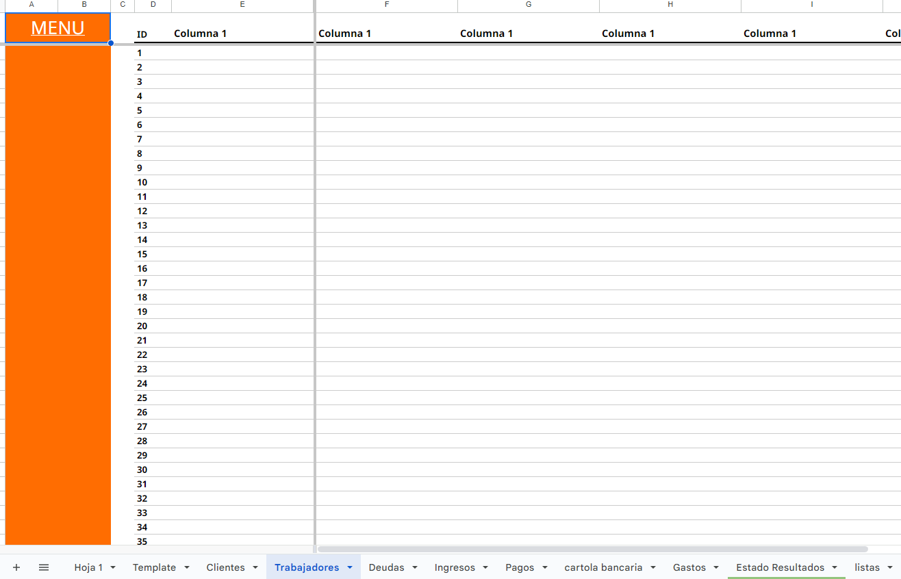

# Creando sistemas para emprendedores

1. Definir el problema
2. Ver cual es la información útil para el negocio. 
3. Ver que información ya se esta registrando (planillas, a mano en cuaderno, etc,)
4. Definir objetivos (informes / dashboard)
5. Definir tablas (Hojas) y Atributos (Columna)

## Construyendo planillas

### Estilos
1. Definir Tipografía en formato > Temas (Recomiendo Noto Sans )
2. Dejar las primeras dos columnas con color corporativo (una gruesa otra de margen)
3. A continuación otra columna blanca de margen
4. En la 4ta columna (D) comienzan las tablas
5. Seleccionar todo el rango de E:Z (o hasta donde se necesite) > ir a formato y Colores Alternos
6. Personalizar. Se recomienda crear una hoja "tipo" para tablas (la suelo llamar "template") para ir copiandola y que quede todo con el mismo formato 
7.  Cambiar configuración de $ a Chile (Archivo > Configuración > Configuración Regional)
8.  Que esta hoja "template" **No tenga nombres de rango** (sino se duplicarán)

## Validación de datos

Permite restringir que tipo de datos puede ingresar un usuario en una columna
- Evita errores
- En algunos casos agiliza el tipeo de datos

Ejemplos de uso
- Solo se pueda ingresar datos de un listado (Ejemplo: pendiente, aprobado, rechazado) 
- Solo se pueda ingresar datos de otro rango (Ejemplo: Solo Gastos de nuestra lista de tiposDeGastos) 
- Solo se puedan ingresar Fechas (Esto tambien habilita que al hacer doble clic en esas casillas , de despliegue un mini calendario)
- Solo se puedan ingresar números
- Casillas de verificación (Clickeables)
- y más....

## Protección de hojas
- Click derecho en el nombre de hoja > Proteger Hoja
- Recomendación: proteger solo con "advertencia"
- Si es una tabla solo proteger celdas con formulases
- Si es un informe proteger todo excepto "variables" (ej: lista desplegable donde se selecciona el periodo) 

## Nombre de rangos

1. Selecciona el rango (Ej: columna completa)
2. Ve a 
	1. Opción 1: Arriba a la izquierda, debajo del "buscador" aparece el nombre de tu selección. Despliega la casilla y al final de la lista dira "Gestionar Intervalos Con Nombre"
	2. Opción 2: Menú Datos > Intervalo con nombres
3. pon el nombre al intervalo

### Nombre Columnas

Recomendación de nombre:
(nombre de hoja en plural + "."(punto) + nombre columna en singular)
si algo tiene más de una palabra, usar **Camelcase**

> camelCase: poner la primera palabra en minuscula y las sigueintes en mayuscula para distinguir palabras

**Ejemplos:**

| Hoja           | Columna               | Nombre de rango Sugerido       |
| -------------- | --------------------- | ------------------------------ |
| Clientes       | Nombre de Contacto    | clientes.nombreContacto        |
| Clientes       | categoria             | clientes.categoria             |
| Ingresos       | Monto Bruto           | ingresos.montoBruto            |
| Ingresos       | Fecha de Resultado    | ingresos.fechaResultado        |
| detalle Ventas | Cantidad De Productos | detalleVentas.cantidadProducto |
### Nombre tablas

Recomendación de nombre:
('TABLA' + "_" (guion bajo) + nombre hoja en plural)
todo en MAYUSCULAS para diferenciar

**Ejemplos:**

| Hoja           | Nombre de rango Sugerido |
| -------------- | ------------------------ |
| Clientes       | TABLA_CLIENTES           |
| Ingresos       | TABLA_INGRESOS           |
| detalle Ventas | TABLA_DETALLE_VENTAS     |

> [!TIP]
> Poner nombre a los rangos facilita tanto la creación como  la comprensión de formulas

## Resumen Check List tablas
- [ ] Todas las columnas con formato de datos correspondientes (Si no, se generan errores con Query)
- [ ] Todas las columnas con nombre de rango
- [ ] Tablas que contienen la información con nombre de rango
- [ ] Proteger Columnas con formulas 

## DASHBOARDS

> PROXIMAMENTE ...

Link de interes:

[Documentacion Oficial QUERY](https://developers.google.com/chart/interactive/docs/querylanguage?hl=es-419)

